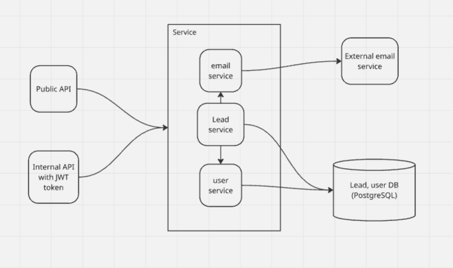

# Leads Management API - Design Document

## Overview

The API is designed to handle legal lead submissions with CV uploads, providing 
both public submission capabilities and secure administrative functions.

## Requirement
- Public Lead Submission: Allow potential clients to submit their information anonymously
- Document Management: Handle CV/resume file uploads securely
- Automated Notifications: Send confirmation emails to leads and alert attorneys
- Lead Processing Workflow: Enable attorneys to review and update lead status
- Secure Access Control: Protect internal operations with JWT authentication

## Architecture

### High-Level Architecture

### Technology Stack

- **API Framework**: FastAPI (Python)
- **Database**: PostgreSQL (good for struct data and allow to store blob data)
- **ORM**: SQLAlchemy
- **Authentication**: JWT Bearer token required with TTL of 30 min.
- **File Storage**: use a BLOB in the same lead table
- **Email**: SMTP with aiosmtplib
- **Containerization**: Docker & Docker Compose

### System Components

- Public API: Unauthenticated endpoints for lead submission
- Internal API: JWT-protected endpoints for lead management
- User Service: User registration and authentication
- Email Service: Automated notifications via configurable SMTP
- Lead Service: Core business logic for lead lifecycle management

## Entities
### Lead
Stores lead information and processing state.

- id: int
- email: string,
- f_name, string,
- l_name: string,
- CV_name: string,
- state: string
- CV-content: Blob

### User
Stores internal user credentials for authenticated access.

- username: str
- password: bytes (pass_hash)
- created_at: timestamp

## API
### Lead
#### POST: /leads/  (without auth)  
- **Body**:
  - email: str
  - f_name: str
  - l_name: str
  - CV: file
- Response:
  - HTTP 204

### [auth] GET: /internal/leads/
  - header: Authorization: Bearer
  - query params:
    - email: str (optional)
    - f_name: (optional)
    - l_name: (optional)
    - state: string (optional)
  - Response HTTP 200:
    - Array of:
      - id: int
      - email: string,
      - f_name, string,
      - l_name: string,
      - CV_name: string,
      - state: string
#### [auth] PATCH: /internal/leads/<id> 
  - header: Authorization: Bearer
  - Body:
      - status: string
  - Response:
    - HTTP 204
#### [auth] GET: /internal/leads/<id>/cv-download
  - header: Authorization: Bearer
  - Response:
    - HTTP 200 with bytes

### User
#### POST /internal/auth/register   (create a new user)  
  - Body:
    - username: string
    - password: string
  - Response:
    - HTTP 204
#### POST /internal/auth/login
  - Body:
    - username: string
    - password: string
  - Response:
    - access_token: string

For authentication, the API will use a JWT token.

### Current Limitations

1. **File Storage**: Files stored in database 
2. **Email**: Synchronous sending (might cause delays)
3. **Single Instance**: No horizontal scaling considerations
4. **Vulnerable**: no DDoS attacks protections on the public endpoint